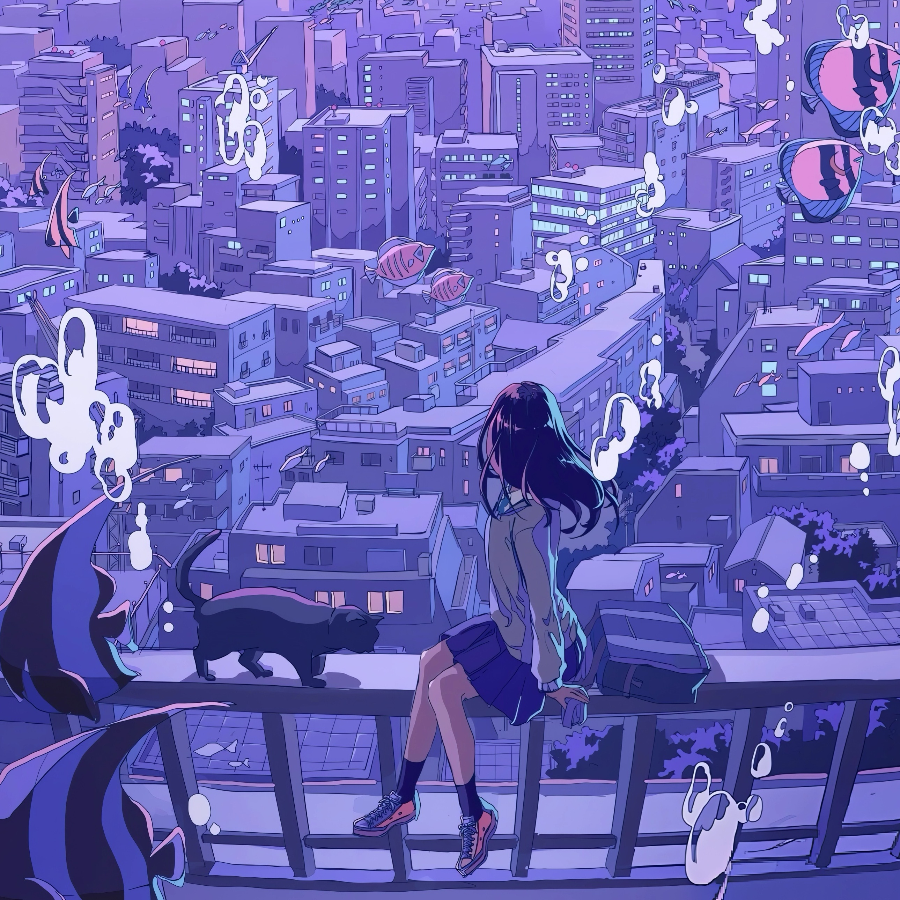

<!-- 加载 Inter 字体 -->
<link rel="preconnect" href="https://fonts.googleapis.com">
<link rel="preconnect" href="https://fonts.gstatic.com" crossorigin>
<link href="https://fonts.googleapis.com/css2?family=Inter:wght@900&display=swap" rel="stylesheet">

<!-- 预加载头像图片 -->
<link rel="preload" href="docs/assets/avatar_github.png" as="image" fetchpriority="high">
<!-- abies-header.html -->

  <!-- 左侧：文字内容 -->
  

    
Hi, I'm Abies

    

      
        |
      
    

  

  <!-- 右侧：头像及光辉 -->
  

    

      

      

        
        
      

    

  

<!-- 打字机效果脚本 -->

